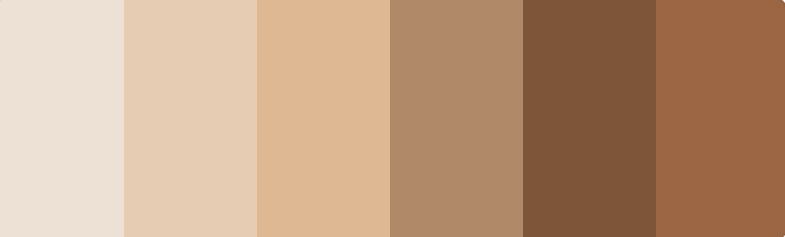
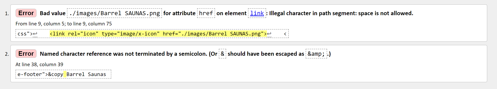
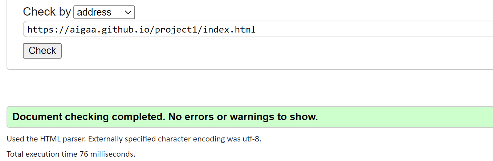
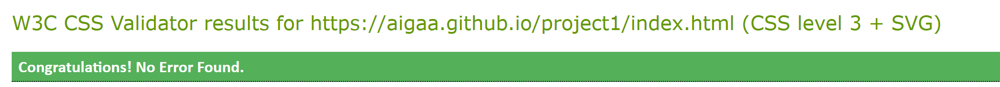
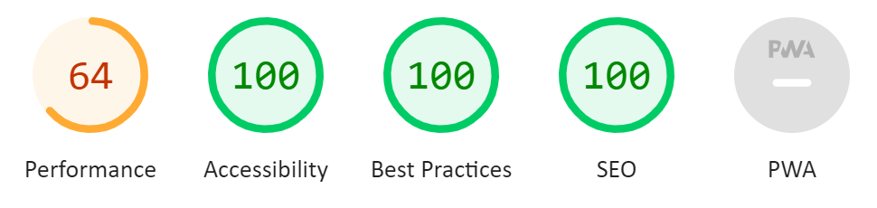
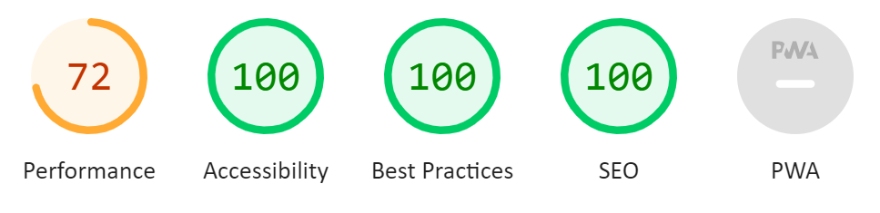
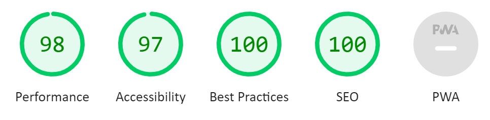

# Barrel Saunas Ireland

Deployed website can be viewed here: https://aigaa.github.io/project1/index.html

## Table of contents
- [About](#about)
    - [Target Audience](#audience)
- [Design](#design)
    - [Wireframes](#wireframes)
        - [Main Page](#main-page)
        - [About Page](#about-page)
        - [Contact Us](#contact-us)
    - [Color Scheme](#color-scheme)
    - [Typography](#typography)
    - [Images](#images)
- [Technologies Used](#technologies-used)
    - [Main Languages Used](#languages)
- [Testing](#testing)
    - [Compatibility Checks](#compatibility-checks)
    - [Validator Testing](#validator-testing)
    - [Bugs](#bugs)
    - [Unfixed Bugs](#unfixed-bugs)
- [Deployment](#deployment)
    - [Github pages](#github-pages)
- [Resources](#resources)

## About the project 
This project is done as part of a Code Institute Full Stack Web Development course. The first project is mainly written in HTML and CSS, while making sure, it is responsive and works well across other devices with different screen sizes, such as phones, tablets, smaller screens, or larger screens. 

This project is created to showcase some of the fine art of a local business that provides barell saunas across the Ireland. This website shows just a small glimpse in what they are doing and what the goal is, and there is a lot potential to add all other information, work, etc. into this website in the future commits. 

### Target Audience 

The target audience for this website would be people who are passionate about various ways to improve their health and are seeking for hassle free sauna installations, and where a low-maintenance needeed to keep running such saunas. Anyone, who is looking for that SPA in their own garden, that is budget friendly and easy to maintain.

## Design 
### Wireframes 

Initially wireframes were done with pen and paper. 
Potentially for the future projects, I would be using Balsamiq to create any wireframes. 

- #### Main page 

The landing page of this website has a slideshow, that I used --webkit-animation to set timing and it is scrolling infinite and --webkit-keyframes to set slides scrolling.

The landing page has Menu bar at the top with transparent background that allows overflow the image full screen. 

The logo was custom-made using canva.com. It was implemented as favicon for the website and can be seen on top of the page when website is open.

The landing page also has a footer on the bottom and a banner with text for the page.

Preview of the landing page

- #### About page 

I have added sections to describe little more about why sauna is so good and have listed benefits of it, and an actual craftsman himself. 

Each section is highlighted in opposite colors, so it is more readable

What it is section

Benefits of sauna section

Story about the craftsman

Navigation bar was set to fixed, so it follows the page when scrolling down.

At the bottom there is a footer that has social media links added and Copyright section.
Both navigation and footer has been in bold dark color,  to make a contrast with rest of the page.

- #### Contact Us 

Contact Us page includes a form that would allow user to send an email to us. (No actual email has been set up this to be sent to)

Each form field is set to their types. Name for name. Email for email and Message for textarea.

The Submit button is set to submit type. When you click on 'Submit', it will redirect to another page - Thank You page. 

### Color Scheme 

Color scheme was designed to set more natural look for the website. Brown and tan notes throughout the website. 
The color pallete was chosen from [Coolors](https://coolors.co/).

### Typography 

For this project simple font style was chosen - Lato font downloaded from [Google Fonts](https://fonts.google.com/) 

### Images 

All images in this project are taken from personal files. And logo has been created using [Canva](https://www.canva.com).

## Technologies Used 
### Main Languages Used 

HTML and CSS were main languages used for this project.

## Testing 
### Compatibility Checks 

Chrome Developer tools were used the most to see responsiveness of the website on different device sizes, and adjusting @media queries to fix bugs.

Checking each time when adding new styles or applying new changes.

Small screen devices  

Mobile versions  

Once the website was deployed, I did multiple checks across mobile phones and tablets. Unfortunately, I do not have any Apple products, and wasn't able to check those.

Also, it was checked across multiple brwsers: Chrome, Microsoft Edge, Firefox. No issues were found there.

### Validator Testing 

- The website was constantly tested during development using Chrome dev tools.
- All links, buttons and form required fields were tested.
- Website was tested in Chrome, Firefox and Microsoft Edge.
- Extensive Mobile compatibilaty was checked through various devices: phones, tablets, medium and large screen devices. 

- HTML
    - An error was returned when first tested website through the official [W3C validator](https://validator.w3.org/nu/?doc=https%3A%2F%2Faigaa.github.io%2Fproject1%2Fthankyou.html)  
     

    - These issues were fixed in the whole project, followed no errors (all pages has been tested)
    

- CSS
    - There were no errors found when testing through the official [W3C CSS Validator](https://jigsaw.w3.org/css-validator/validator?uri=https%3A%2F%2Faigaa.github.io%2Fproject1%2Findex.html&profile=css3svg&usermedium=all&warning=1&vextwarning=&lang=en)  
      

- Lighthouse 
    - Lighthouse was used to test the website for Performance, Accessibility, Best Practices and SEO for desktop and mobile:
    - Home page:  
    

    Very low on performance score here. This was slightly approved after adjusting image size, and current score is: 
    

    - About page:  
    

### Bugs 

Checking media queries, footer on contact page had to stick to the bottom. When checking all 
different screen sizes on Chrome Developer tool, it showed footer sticking in the middle, or overflowing
the content. I added @media query for smaller width size to set max-width of 375px position to unset, so this does not overflow the content. When Checking Nest Hub the footer was again overflowing the content. 
This thread was helpful to fix this [Stackoverflow](https://stackoverflow.com/questions/11404744/css-media-queries-max-width-or-max-height) with option to add max-height to the existing media query, and this fixed my issue with the footer. 

### Unfixed Bugs 

All bugs were dealt with at the time when issue arised.

## Deployment 

### Github Pages 

Repository: [https://github.com/AiGaA/project1](https://github.com/AiGaA/project1)

1. On GitHub, navigate to your site's repository. 
2. Under your repository name, click  Settings. If you cannot see the "Settings" tab, select the  dropdown menu, then click Settings.
3. In the "Code and automation" section of the sidebar, click Pages.
4. To see your published site, under "GitHub Pages", click Visit site.
4. Your GitHub Pages site is built and deployed with a GitHub Actions workflow.

The site deployed: [https://aigaa.github.io/project1/index.html](https://aigaa.github.io/project1/index.html)

### How to Fork 

1. On GitHub, go to [https://github.com/AiGaA/project1](https://github.com/AiGaA/project1)
2. In the top right, click 'Fork'.

### How to Clone 

1. Locate the [Repository](https://github.com/AiGaA/project1)
2. Go to the main page of the repository.
3. Above the file list, click "Code".
4. Select HTTPS, SSH, or GitHub CLI and then click copy to clone it.
5. Open Git Bash.
6. Change the location of your cloned repository.
7. Type git clone and then paste the URL you copied.
8. Press “Enter” to create your clone.

## Resources 

Here are some resources I used for this project:

- [Google Fonts](https://fonts.google.com/)
I downloaded Lato font library, that I applied in my styles and used throughout the project

- [Font Awesome](https://fontawesome.com/icons)
Font Awesome I used for social media icons: facebook, instagram and twitter

- [Stackoverflow](https://stackoverflow.com/)
Every other question popped up, was going through this website

- [Canva](https://www.canva.com)
I used it to create my logo

- [W3 Schools](https://www.w3schools.com/)
For generic information, as sometimes can forget even how to align things. It came great help on how to adjust photos

- [Pexels](https://www.pexels.com/)
Searching good images. Most of my images are from my own archives, but this was great to search for something fresh

- Slack channel #project-portfolio-1
I had great struggle on ideas, and it was very inspiring to see other people work as well

- [Am I Responsive?](https://ui.dev/amiresponsive)
To have overview of my website and how responsive it looks
